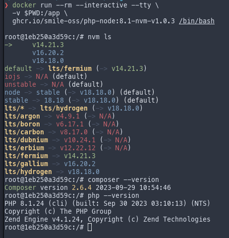

# PHP with Node for Ci/Cd

## Oficial images

- [PHP](https://github.com/docker-library/php)
- [Composer](https://github.com/composer/docker)
- [Node.js](https://github.com/nodejs/docker-node)

## Usage

Please use `task --summary` to see all available tasks with their description.

Current status:

